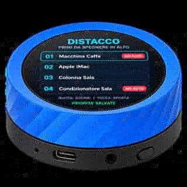
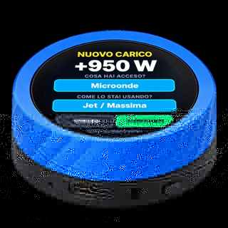

# HackMyHome Power Control

Power Control per **Home Assistant + ESPHome**, realizzato per il **Waveshare ESP32-S3 1.8" Knob Touch LCD**.

Il progetto trasforma il Knob in una console portatile per:

- monitorare il consumo totale della casa;
- vedere il contributo dei principali elettrodomestici;
- definire priorità di distacco;
- escludere i carichi che non devono essere spenti automaticamente (**NO AUTO**);
- controllare alcuni dispositivi direttamente dal display;
- personalizzare colori e comportamento dell'interfaccia;
- apprendere i profili di consumo di carichi non monitorati direttamente da Home Assistant;
- ricevere feedback aptico tramite il motore integrato.

> **Stato del progetto: in sviluppo / beta.** Il firmware è stato testato nella configurazione HackMyHome, ma può richiedere adattamenti alla propria installazione.

  

## Hardware

- Waveshare ESP32-S3 1.8" Knob Touch LCD
- Home Assistant
- ESPHome
- un sensore Home Assistant che esponga la potenza totale della casa in watt
- opzionalmente, sensori di potenza e comandi switch / climate per i singoli elettrodomestici

### Link hardware

- [Amazon - Waveshare ESP32-S3 Knob Touch LCD 1.8"](https://amzn.to/4duLnAk)
- [Waveshare - ESP32-S3 Knob Touch LCD 1.8"](https://www.waveshare.com/esp32-s3-knob-touch-lcd-1.8.htm)

Usando il link affiliato puoi sostenere HackMyHome senza costi aggiuntivi per te. Prezzi e disponibilità possono cambiare nel tempo.

## Funzioni principali

### Dashboard consumi
La Home mostra la potenza complessiva, le zone di consumo e il contributo dei dispositivi monitorati. La parte non attribuita viene visualizzata come **Altri consumi**.

### Priorità di distacco
Quando il consumo si avvicina alla soglia configurata, Power Control può individuare un carico candidato al distacco in base all'ordine di priorità.

La priorità **non indica quale dispositivo consuma di più**: indica quale dispositivo siamo più disposti a sacrificare per primo.

I dispositivi marcati **NO AUTO** non vengono selezionati per il distacco automatico.

### Apprendimento dei carichi
Quando aumenta la quota di consumo non attribuita, il Knob può chiedere cosa è stato acceso e in quale modalità. Le conferme successive costruiscono un archivio locale di profili energetici.

L'apprendimento è **diagnostico**: i profili appresi non vengono usati automaticamente per decidere un distacco.

### Feedback aptico
Il firmware usa il driver DRV2605 e il motore aptico integrato nel Knob per segnalare soglie, richieste di attenzione e altri eventi.

## Interfaccia

| Dashboard | Priorità di distacco |
| --- | --- |
|  |  |
| **Elettrodomestici** | **Apprendimento carichi** |
|  |  |

Le immagini mostrano le principali schermate dell'interfaccia utilizzata nel progetto HackMyHome. Nomi, potenze, colori e dispositivi dipendono dalla configurazione della propria installazione Home Assistant.

## Installazione rapida

1. Scarica [esphome/hackmyhome_power_control.yaml](esphome/hackmyhome_power_control.yaml).
2. Copialo nella cartella ESPHome di Home Assistant.
3. Configura secrets.yaml con Wi-Fi e chiave API ESPHome.
4. Modifica la sezione **substitutions** con i tuoi entity_id e le tue soglie.
5. Esegui **Validate** in ESPHome.
6. Installa il firmware sul Knob.
7. Verifica prima il funzionamento con **distacco automatico disabilitato**.

Documentazione:
- [Installazione](docs/installation.md)
- [Configurazione](docs/configuration.md)
- [Apprendimento](docs/learning.md)
- [Changelog](CHANGELOG.md)

## Sicurezza

Power Control può comandare dispositivi reali attraverso Home Assistant. Non usare il distacco automatico su carichi essenziali, critici, medicali, di sicurezza o che non possano essere interrotti in modo sicuro.

Il distacco automatico parte **disabilitato**. Verifica la lista, i comandi e le priorità prima di abilitarlo.

Il progetto non sostituisce protezioni elettriche, magnetotermici, differenziali o sistemi certificati di gestione della potenza.

## Configurazione di esempio

Il file pubblicato contiene gli entity_id usati nell'installazione HackMyHome come esempio. **Devono essere adattati** alla tua installazione Home Assistant.

Le credenziali non sono incluse nel repository: il firmware usa !secret per SSID, password Wi-Fi e chiave API ESPHome.

## Ispirazione e crediti

Il progetto nasce dall'idea di controllo dei carichi di [Power-Control-HomeAssistant](https://github.com/Home-Assistant-Pro-Team/Power-Control-HomeAssistant) e la estende con un'interfaccia fisica dedicata sul Waveshare Knob, gestione locale dell'interfaccia, feedback aptico e apprendimento dei carichi.

Per il feedback aptico viene utilizzato il componente ESPHome esterno [RAR/esphome-drv2605](https://github.com/RAR/esphome-drv2605).

## Feedback e bug

Il progetto è in evoluzione. Se lo provi e trovi un problema, apri una **Issue** indicando versione ESPHome, versione Power Control, comportamento atteso, comportamento osservato e log rilevanti. Evita di pubblicare password, token o altre informazioni sensibili.

Suggerimenti e idee per nuove funzioni sono benvenuti.

## Licenza

Distribuito con licenza [MIT](LICENSE).
